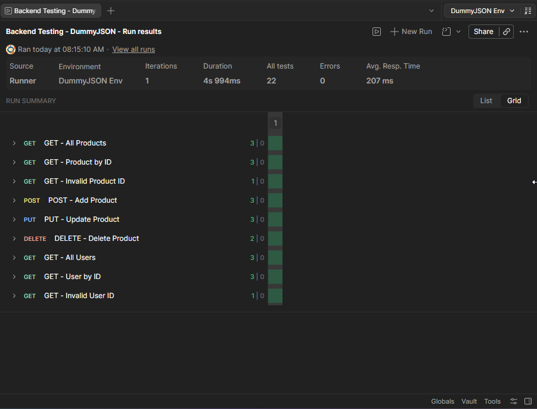
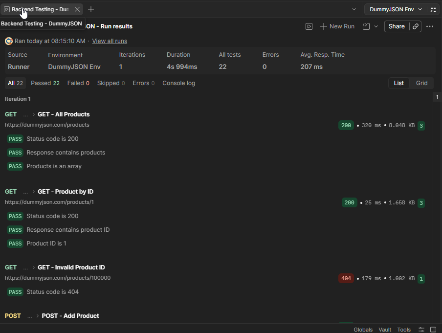
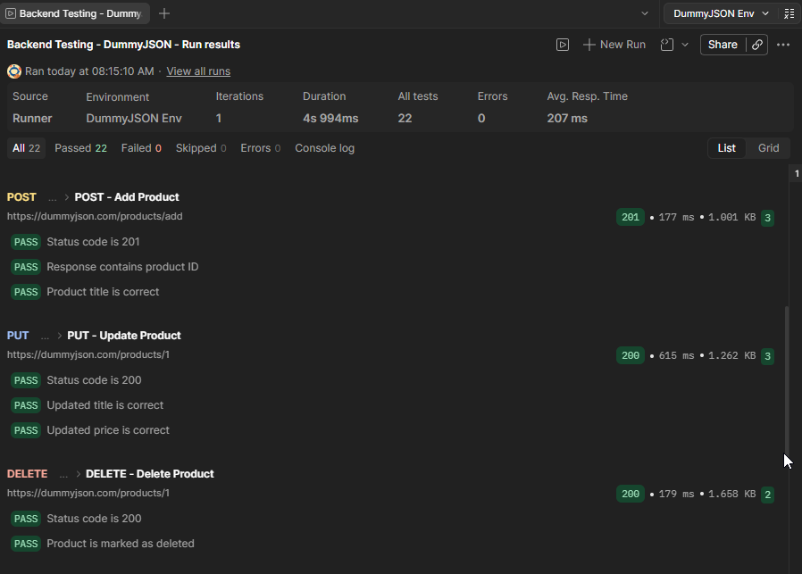
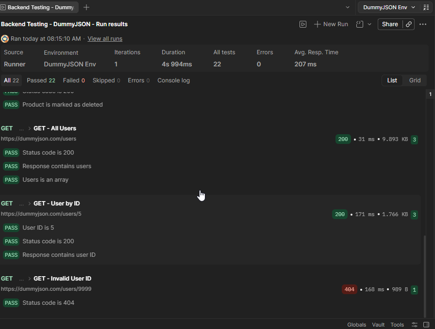

# Backend Testing — API & SQL (DummyJSON)


Proyecto de QA enfocado en **testing de APIs REST** y **validación de datos con SQL** sobre la API pública de **DummyJSON**.

## 📋 Sobre este proyecto

Este proyecto complementa mi portfolio de testing manual y automatización. En este caso, trabajé con **API Testing** y **validación de datos con SQL**.

Documenté pruebas sobre los recursos **Products** y **Users** utilizando **Postman**, incluyendo validaciones de códigos de estado HTTP, estructura y contenido de las respuestas mediante assertions con `pm.test`.

Además, armé una base de datos en **SQLite** para practicar consultas SQL y complementar las pruebas realizadas sobre la API.

Para este proyecto elegí **DummyJSON** porque es una API REST sencilla y me permitió practicar diferentes escenarios de testing.

---

## 🎯 Alcance

* 🧪 **API Testing:** Operaciones CRUD sobre el recurso **Products** y consultas GET sobre **Users**, incluyendo casos válidos e inválidos.
* ✅ **Assertions:** Validaciones escritas en Postman (`pm.test`) sobre status code, estructura y contenido de la respuesta.
* 🗄️ **SQL:** Base de datos local en SQLite con tablas de ejemplo, con consultas comentadas paso a paso para practicar filtros y búsquedas frecuentes de QA.
* 📄 **Documentación:** Cada request tiene su propio archivo explicando qué se hizo, qué se validó, cómo y qué resultado se obtuvo.

---

## 🛠️ Herramientas utilizadas

* **API Testing:** Postman (collections, requests, `pm.test`).
* **Base de datos:** SQLite (DB Browser for SQLite).
* **Control de versiones:** Git y GitHub.

---

## 🧪 Cobertura de API Testing

| ID       | Recurso  | Método | Descripción                      |
| :------- | :------- | :----: | :------------------------------- |
| **API1** | Products |   GET  | Obtener todos los productos      |
| **API2** | Products |   GET  | Obtener producto por ID válido   |
| **API3** | Products |   GET  | Obtener producto por ID inválido |
| **API4** | Products |  POST  | Crear un producto nuevo          |
| **API5** | Products |   PUT  | Actualizar un producto existente |
| **API6** | Products | DELETE | Eliminar producto (soft delete)  |
| **API7** | Users    |   GET  | Obtener todos los usuarios       |
| **API8** | Users    |   GET  | Obtener usuario por ID válido    |
| **API9** | Users    |   GET  | Obtener usuario por ID inválido  |

📎 [Ver toda la documentación de requests](api-testing/test-cases/)

> **Nota:** DummyJSON es una API de práctica que solo simula las respuestas de `POST`, `PUT` y `DELETE`, pero no guarda los cambios de verdad en su servidor. Por eso, los cambios no se ven reflejados si se vuelve a consultar el recurso.
---

## 📊 Resultados de la ejecución

✅ **22 de 22 tests pasaron (100% de ejecución exitosa en Postman Collection Runner).**



Para **API4 (POST)** y **API6 (DELETE)** se incluye el JSON de respuesta como texto dentro de la documentación, en vez de captura, ya que el dato en sí es lo relevante a validar.

<details>
<summary>Ver el detalle completo de los 22 tests (vista List de Postman)</summary>







</details>

---

## 🗄️ SQL 

Como DummyJSON no guarda los cambios de forma real en su servidor (solo simula la respuesta), armé una base de datos local en SQLite con tablas de productos y usuarios. 

Ahí practiqué consultas SQL comunes en el trabajo de QA:
* Ver todos los registros de una tabla (`SELECT *`)
* Buscar productos sin stock.
* Filtrar productos por precio.
* Filtrar usuarios por edad.
* Contar cantidad de productos por categoría.

> 📎 *Podés ver los comandos y ejemplos de consultas en `sql/db_validation.sql`.*

---

## 📁 Estructura del repositorio

```text
backend-testing/
├── README.md
├── .gitignore
│
├── api-testing/
│   ├── postman/
│   │   └── dummyjson.postman_collection.json
│   ├── test-cases/
│   │   ├── products/
│   │   │   ├── API1-get_all_products.md
│   │   │   ├── API2-get_product_by_id.md
│   │   │   ├── API3-get_invalid_product_id.md
│   │   │   ├── API4-post_add_product.md
│   │   │   ├── API5-put_update_product.md
│   │   │   └── API6-delete_product.md
│   │   └── users/
│   │       ├── API7-get_all_users.md
│   │       ├── API8-get_user_by_id.md
│   │       └── API9-get_invalid_user_id.md
│   └── evidencia/
│       ├── runner_results.png
│       ├── runner_results_2.png
│       ├── runner_results_3.png
│       └── runner_results_4.png
│
└── sql/
    ├── db_validation.sql
    └── qa_portfolio.db
```

---

## 🙋🏻‍♀️ Sobre mí

Me interesa el testing de software, con formación práctica en **pruebas manuales**, **automatización E2E** y, en este proyecto en particular, **Testing de APIs** y **validación de datos con SQL**.

Este repositorio es la segunda parte de mi portfolio de QA. La primera está enfocada en testing manual y automatización con Cypress: [qa-portfolio](../qa-portfolio).

Estoy buscando mi primera oportunidad formal en QA, con ganas de seguir aprendiendo dentro de un equipo real.

📫 **Contacto:** [LinkedIn](https://www.linkedin.com/in/hilenortiz) • [Email](mailto:hilenortiz@gmail.com)
